# Stocket MCP API design

Status: proposed architecture
Target protocol: MCP 2025-11-25
Stocket contract: v1
Transport endpoint: `/api/v1/mcp`

This document defines the target MCP surface for the whole Stocket platform.
It is intentionally broader than the currently implemented product slice. It
decides how tools are named, discovered, authorized, confirmed, executed,
reported, and undone before more feature modules are exposed.

## Decision summary

1. MCP is an application boundary over Effect domain services. It is not
   generated from HTTP routes and never calls another module's repository.
2. Expose narrow domain queries and commands. Do not expose a generic CRUD,
   SQL, repository, status-setting, task-enqueueing, or arbitrary tool-call
   escape hatch.
3. Every AI command that changes business state is executed through a durable,
   transactional change-set pipeline. Low-risk commands may apply immediately;
   risky commands require a persisted immutable proposal and a durable
   server-validated approval grant.
4. Confirmation and undo are complementary. Confirmation prevents an
   unintended action; undo safely reverses an applied action when no newer work
   would be overwritten.
5. The model sees only tools allowed by the current actor's permissions,
   tenant features, client scope, and toolkit. The same rules are rechecked at
   execution time.
6. Operational concepts use semantic commands. In particular, inventory
   receives, adjustments, counts, and transfers must update inventory and
   write stock-movement history atomically. They must never call the current
   raw inventory or stock-movement write methods directly.
7. The tenant chatbot and privileged administration are separate toolkits.
   Superadmin/platform operations are not part of the tenant MCP server.

## Goals

- Let nontechnical users find and manage products, categories, locations,
  areas, suppliers, clients, inventory, and orders through conversation.
- Make single and bulk AI changes inspectable, retry-safe, concurrency-safe,
  attributable, and undoable where the domain permits it.
- Support the embedded Stocket chatbot first and a standards-compliant remote
  MCP server later without duplicating domain behavior.
- Keep schemas small and model-friendly while providing stable IDs, versions,
  resources, and structured outputs for follow-up actions.
- Give each feature one reusable definition from which protocol descriptors,
  access checks, safety behavior, documentation, and conformance tests are
  derived.

## Non-goals

- Mirroring every REST endpoint.
- Exposing permanent delete, tenant deletion, secrets, session tokens,
  plaintext passwords, raw database access, internal task payloads, or
  superadmin controls.
- Using the audit log, MCP session state, or MCP Tasks as the undo ledger.
- Letting a tool argument such as `confirmed: true` bypass approval.
- Allowing external lookup results to write directly into Stocket.
- Replacing the first-party AI host's model loop with MCP sampling.

## Architecture

```mermaid
flowchart LR
  Client["MCP client / Stocket AI host"] --> Edge["Streamable HTTP adapter"]
  Edge --> Scope["Verified actor, tenant, locale, client capabilities"]
  Scope --> Registry["Permission-aware capability registry"]
  Registry --> Query["Query definition"]
  Registry --> Command["Command definition"]
  Query --> Domain["Owning Effect domain service"]
  Command --> Changes["ChangeExecutionService"]
  Changes --> Plan["Persist immutable proposal"]
  Plan --> Policy["Evaluate approval policy"]
  Policy --> Approval["Form or URL approval when required"]
  Approval --> Apply["Transactional apply + change items"]
  Apply --> Domain
  Apply --> History["Change history / undo"]
```



The MCP module owns protocol translation only:

- MCP lifecycle, transport, sessions, and capability negotiation;
- Effect Schema decoding and output encoding;
- tool/resource registration and permission-filtered discovery;
- conversion of protocol elicitation into an application approval decision;
- protocol error and content rendering; and
- resource links, progress, and optional MCP Task adapters.

Application modules own correctness:

- permissions and feature access;
- domain validation and canonical errors;
- transactions and tenant fencing;
- idempotency and optimistic concurrency;
- durable operations and change sets;
- undo/compensation rules; and
- external integration credentials and provenance.

The durable change-set service must be reusable by normal UI actions. “AI
undo” is not an MCP-only feature.

## MCP primitive mapping

| MCP primitive | Interaction owner                  | Stocket use                                                      |
| ------------- | ---------------------------------- | ---------------------------------------------------------------- |
| Tools         | Model-controlled                   | Search, calculations, and named domain commands                  |
| Resources     | Application-controlled             | Stable entity, proposal, change-set, and operation snapshots     |
| Prompts       | User-controlled                    | Optional user-selected workflows that guide tool use             |
| Elicitation   | Server-requested UI                | Plain-language approval and secure out-of-band integration setup |
| Tasks         | Requestor-controlled, experimental | Optional adapter over Stocket's durable background operations    |
| Progress      | Request-scoped                     | Bounded progress for validation, imports, and bulk operations    |

Tools remain available for reads even when equivalent resources exist because
many clients are tool-centric. Resources are the canonical link target for
entity details and durable workflow state.

Do not advertise `listChanged`, resource subscriptions, Tasks, or another
optional capability until it is fully implemented. Capture negotiated client
capabilities in the invocation context and use only supported modes.

## Tool naming and versioning

Use snake case:

```text
<plural_domain>_<intent>
```

Examples:

- `products_search`
- `products_update`
- `products_update_many`
- `inventory_transfer`
- `change_sets_undo`

MCP itself permits dots, but snake case is also compatible with model-provider
function-tool bridges that permit only letters, digits, underscores, and
dashes. Keep names at most 64 characters for that same interoperability
reason.

Naming rules:

- use a plural domain noun and a user/domain verb;
- use `_many` when cardinality changes the contract or safety policy;
- never use HTTP verbs or repository terminology;
- never put tenant, user, role, provider, or version IDs in the name;
- keep a name stable for additive, compatible schema evolution;
- introduce a parallel `_v2` name for a breaking input or output change;
- retain a deprecated alias for a migration window only if a client has
  already consumed the old name; and
- publish a generated contract manifest so CI detects accidental changes.

Before broader release, rename `products_list` to `products_search`. If the
current internal name has already shipped to a client, retain it as a temporary
alias; otherwise migrate it directly.

The endpoint version and tool-contract version are independent:

- `/api/v1/mcp` versions the Stocket HTTP boundary;
- MCP protocol version is negotiated during initialization; and
- each tool/resource definition carries a Stocket contract version in
  namespaced metadata.

The server implementation version should come from the application package,
not a hardcoded string.

## Discovery and toolkits

The server's `tools/list` response is the complete authoritative catalog for
the current invocation, filtered by:

- authenticated actor and tenant;
- current permissions;
- enabled tenant features;
- remote OAuth scopes, when remote access exists;
- selected toolkit; and
- operational readiness of the underlying workflow.

Filtering improves model selection but is not authorization. Every call is
checked again, and a command is reauthorized immediately before apply. An
unknown tool and an unavailable/unauthorized tool should produce the same
generic direct-call response so callers cannot enumerate hidden capabilities.

A toolkit is trusted connection configuration, never a model argument. The
embedded host selects it from the Stocket experience being used; a remote
toolkit is bounded by registered client policy and granted OAuth scopes. An
MCP session may narrow its available surface but cannot widen it. Widening
requires a new authenticated/step-up-authorized session.

Use these logical toolkits:

| Toolkit        | Intended surface                                                                                              |
| -------------- | ------------------------------------------------------------------------------------------------------------- |
| Default        | Workspace context, products, categories, locations, areas, suppliers, clients, read inventory, change history |
| Operations     | Inventory commands, orders, fulfillment, imports, long-running operations                                     |
| Administration | Users, roles, security actions; only in a dedicated admin AI experience                                       |
| Operator       | Superadmin/platform operations; separate server if ever built, not this endpoint                              |

The registry should support opaque cursor pagination and deterministic ordering.
Do not claim `tools.listChanged` until active sessions can actually receive a
notification after permissions or features change.

Large catalogs should use progressive disclosure in the first-party AI host:

1. Index the permission-filtered catalog metadata.
2. Select the small set of relevant capabilities for the current turn.
3. Give the model full schemas only for those candidates.
4. Execute the original typed tool directly.

Do not replace typed tools with
`call_tool({ name, arguments })`. Progressive selection is a host concern; the
server keeps the complete typed catalog and direct execution path.

## One definition per capability

The current product implementation proves the transport and Effect adapter,
but its contract is spread across `toolkit.ts`, `handlers.ts`, and `index.ts`.
That split should not be copied into dozens of modules.

Introduce typed factories with one registration per capability:

```ts
defineMcpQuery({
  tool,
  catalog,
  access,
  policy,
  run,
});

defineMcpCommand({
  tool,
  catalog,
  access,
  policy,
  operation,
});

defineMcpFeature({
  domain: 'products',
  contractVersion: 1,
  tools,
  resources,
});

composeMcpRegistry(productsMcp, locationsMcp, inventoryMcp);
```

A definition contains:

- the `@effect/ai` Tool and Effect input/output Schemas;
- stable name, title, description, keywords, domain, intent, and entity kinds;
- required permissions and features;
- query or command policy;
- minimum approval, recovery, external-effect, cardinality, task, and limits
  policy;
- the Effect query handler or registered change operation; and
- typed localization keys for user-visible result, confirmation, and error
  messages.

Factories automatically:

- derive the output codec from `tool.successSchema`;
- set every MCP annotation explicitly;
- use the same access interpreter for listing and calling;
- decode input once and encode output once;
- add versioned `fr.stocket/tool` and `fr.stocket/safety` metadata;
- apply timeouts, rate limits, tracing, logging, and neutral error rendering;
- reauthorize commands before planning and immediately before applying; and
- reject invalid policy combinations at startup.

The composed registry should:

- build a `Map` by name rather than linearly scanning registrations;
- validate naming, duplicate names, operation kinds, recovery references, and
  policy invariants;
- expose a permission-aware `listAvailable` operation;
- derive its required Effect environment rather than maintaining a manual
  service union in `router.ts`; and
- generate a stable JSON contract manifest for CI and the first-party host.

Keep MCP adapters under `modules/mcp/<domain>/`. Put reusable application
correctness in owning modules such as `modules/change-sets/` and
`modules/inventory/operations/`.

## Standard policy model

Every tool is either a query or a command. Invalid combinations should be
unrepresentable in the policy type.

```ts
type RecoveryPolicy =
  | {
      readonly kind: 'transactional_inverse';
      readonly undo_window_seconds: number;
    }
  | {
      readonly kind: 'compensating_action';
      readonly undo_window_seconds: number;
      readonly limitation_key: MessageKey;
    }
  | { readonly kind: 'none'; readonly reason_key: MessageKey };

type ToolPolicy =
  | {
      readonly kind: 'query';
      readonly externality: 'internal' | 'external_read';
      readonly data_sensitivity: 'normal' | 'sensitive';
    }
  | {
      readonly kind: 'command';
      /** Registered, versioned domain operation such as inventory.transfer. */
      readonly operation: string;
      readonly mutation_class:
        | 'create'
        | 'modify'
        | 'archive'
        | 'restore'
        | 'transition'
        | 'control';
      readonly risk: 'low' | 'destructive' | 'physical' | 'security';
      readonly externality: 'internal' | 'external_write';
      readonly cardinality: 'one' | 'many';
      readonly minimum_approval: 'none' | 'explicit';
      readonly recovery: RecoveryPolicy;
      readonly execution: 'synchronous' | 'operation';
    };
```

The central evaluator may elevate `minimum_approval` after inspecting the
prepared impact. It may never lower it.

### Safety tiers

| Tier                           | Examples                                                                                        | Approval           | Recovery                                 |
| ------------------------------ | ----------------------------------------------------------------------------------------------- | ------------------ | ---------------------------------------- |
| Read                           | Internal search/get/summary                                                                     | Never              | Not applicable                           |
| Direct recoverable             | Create one product; low-risk single-field update; own preferences; branding                     | Normally immediate | Durable conditional undo or compensation |
| Approved recoverable           | Archive, bulk change, hierarchy reparent, inventory command, order transition                   | Always explicit    | Durable undo or compensating command     |
| Approved irreversible/external | Send external message, revoke sessions, later shipment                                          | Always explicit    | Honest “cannot undo” result              |
| Prohibited                     | Permanent delete, arbitrary status set, raw stock write, secret/password input, tenant deletion | Not exposed        | Not applicable                           |

These conditions always require explicit approval:

- more than one entity;
- archive, remove, merge, or relationship-wide movement;
- inventory quantity or location changes;
- order/fulfillment lifecycle changes;
- definition-marked sensitive fields such as permissions, security state, or
  financially material values;
- roles, permissions, bans, session revocation, or membership removal;
- an external write or other irreversible side effect; and
- any operation whose prepared impact is greater than its definition's normal
  bound.

MCP annotations are advisory and must all be set explicitly:

- internal query: read-only, non-destructive, idempotent, closed-world;
- external lookup: read-only, non-destructive, idempotent, open-world;
- create: write, normally non-destructive;
- update/archive/inventory decrement: write and conservatively destructive;
- restore: write and normally non-destructive; and
- idempotent only when the server actually deduplicates identical calls.

## Common input contracts

Use JSON-native Effect Schemas at the MCP boundary. Reuse
`@stocket/types` contracts when their wire representation fits. Do not reuse
HTTP query schemas that decode numbers, booleans, or dates from strings.

### Entity references

Search and get results return:

```json
{
  "kind": "product",
  "id": "uuid",
  "label": "Whole Milk 1 L",
  "version": "opaque-server-version",
  "uri": "stocket://products/uuid"
}
```

Mutations use IDs and expected versions. A monotonic database row version and
repository operations whose `WHERE` clause includes that version are
prerequisites for exposing mutable entities. `updated_at` is display metadata,
not an undo/concurrency fence. Apply checks affected-row counts and stores both
the expected and written version in its change item.

Actor ID, tenant ID, roles, permissions, scopes, session identifiers, and
credentials never appear in tool inputs.

### Search pagination

Business search tools use their own cursor fields because MCP protocol
pagination does not paginate arbitrary tool results:

```json
{
  "query": "milk"
}
```

Requirements:

- optional query, filter, cursor, and limit fields are omitted when unused;
- strict schemas reject unknown fields;
- tool-specific maximum text lengths, array lengths, and filter complexity;
- keyset rather than offset pagination;
- opaque signed cursors bound to tenant, filters, search, and sort;
- deterministic ordering;
- default 20 and maximum 100 items;
- concise summary rows rather than full entities; and
- full detail only from `*_get` or a resource.

### Multi-entity targets

Bulk tools accept a discriminated target:

```json
{
  "kind": "ids",
  "entities": [{ "id": "uuid", "expected_version": "opaque-server-version" }]
}
```

or:

```json
{
  "kind": "filter",
  "filter": {
    "category_id": "uuid",
    "is_active": true
  }
}
```

or, for an authorized server-side selection created by the same domain/UI:

```json
{
  "kind": "snapshot",
  "selection_id": "uuid"
}
```

Planning resolves either form into a deterministic, immutable set of IDs and
versions before approval. Approval never authorizes a recomputed filter.
Explicit arrays have a small hard cap declared by the tool. A large arbitrary
set uses a tenant/actor-bound, expiring selection snapshot or staged document;
thousands of IDs must not be passed through model context.

Use `products_update_many` for explicit per-product patches or one bounded
patch over a target. Use `inventory_transfer` for physical stock movement.
Changing a product's category and moving physical inventory are different
commands and must have different wording.

### Retry identity

Idempotency is transport context, not a decision the model should invent.
The first-party host sends a stable
`fr.stocket/idempotency-key` in request metadata. The adapter exposes it in
`McpInvocation` and change-set uniqueness is scoped to tenant, actor,
operation, and key. The stored record also includes tool contract version and
a canonical input/proposal hash. Reusing a key with different normalized input
is a conflict; it must never return an older unrelated task or result.

When metadata is absent, the server creates a key for that call but must not
claim that a separately issued retry is idempotent. A transport disconnect is
not cancellation; clients can retrieve the resulting change set or operation
before retrying.

### Limits

Each definition declares:

- maximum search page size;
- maximum explicit target count;
- maximum prepared target count;
- synchronous execution threshold;
- timeout and per-actor rate limit; and
- maximum returned examples and warnings.

The server rejects an unbounded input before doing expensive work. A target
above the synchronous threshold becomes a durable operation after approval;
the model must not split one user-visible bulk action into many unrelated calls
to evade the limit or approval policy.

## Standard result contracts

Every tool has an output schema and returns conforming `structuredContent`.
Also return:

- a short localized text block for compatibility;
- resource-link blocks for affected entities, proposals, change sets, or
  operations; and
- bounded entity examples rather than thousands of rows.

### Query results

```json
{
  "summary": "Returned 20 products.",
  "returned_count": 20,
  "total": {
    "kind": "estimated",
    "value": 37
  },
  "items": [],
  "next_cursor": "opaque-or-null",
  "warnings": []
}
```

`items` is tool-specific and concise. `total` is optional and explicitly
`exact` or `estimated`; omit it when computing a reliable count would be
expensive.

### Command results

```json
{
  "outcome": "applied",
  "summary": "Renamed 12 products.",
  "change": {
    "id": "uuid",
    "status": "applied",
    "affected_count": 12,
    "uri": "stocket://change-sets/uuid"
  },
  "undo": {
    "available": true,
    "expires_at": "2026-07-22T12:00:00Z",
    "reason": null
  },
  "entities": [],
  "operation": null,
  "confirmation": {
    "status": "not_required",
    "next_step": "none"
  },
  "warnings": [],
  "data": {}
}
```

`outcome` is one of:

- `applied`;
- `awaiting_confirmation`;
- `queued`;
- `not_applied`; or
- `unchanged`.

Use a schema factory such as `makeCommandResultSchema(DataSchema)`. Cancellation
and confirmation-unavailable results must not require an entity that was never
changed. Raw inverse tool names and arguments are not returned; the stable
recovery handle is `change.id`.

An `awaiting_confirmation` result has a typed `confirmation` object:

- `status`: `required`, `declined`, `dismissed`, or `unsupported`;
- `next_step`: `respond_to_elicitation`, `open_approval_url`,
  `approve_in_stocket`, or `none`; and
- an approval URL only when URL mode was negotiated and the URL is safe to
  disclose.

This tells the host what UI action is required and prevents the model from
asking the user to type “yes” into chat as though that were protocol approval.

### Errors

Use JSON-RPC errors for malformed MCP messages, unknown protocol methods, and
transport/protocol failures. Use a tool result with `isError: true` for
validation, not-found, conflict, permission, rate-limit, and domain-rule
failures so the model can correct its action.

Tool failures should contain a localized, entity-neutral text explanation and
namespaced structured error metadata with:

- stable code;
- retryable flag;
- safe field-level details when useful; and
- the relevant resource/change reference when disclosure is authorized.

Never leak infrastructure errors, SQL details, tokens, or whether a hidden
tool exists. Remove product-specific wording from the shared adapter.

## Data minimization and provenance

Tool access does not imply that every domain field belongs in model context.

- Search results contain the minimum summary needed to disambiguate entities.
- Detail tools and resources have explicit schemas rather than arbitrary field
  projection or raw row output.
- Cost, contact, address, user, audit, and security data require their owning
  read permission and an appropriate toolkit/scope.
- Secrets, session data, password hashes, provider tokens, internal task
  payloads, and redacted change fields are never model-visible.
- Logs record IDs, policy decisions, counts, and timings without copying
  sensitive prompts, snapshots, or tool output by default.
- Stored values and external results are treated as untrusted data, never as
  instructions to the model or server.

Every applied command records `origin: "mcp"`, the verified actor, approving
actor, client identity, operation version, and optional sanitized conversation
correlation. This provenance supports user-visible history and diagnostics but
does not replace authorization or the transactional change ledger.

## Durable command and undo lifecycle

All AI commands that change business state use the same application pipeline:

1. **Authorize:** Check current actor, tenant, permission, feature, and scope.
2. **Prepare:** Resolve exact targets and capture schema-versioned before/after
   data, expected versions, actual impact, representative examples, and an
   expiry.
3. **Persist:** Store the immutable proposal, proposal hash, actor, tenant,
   operation version, and idempotency key.
4. **Evaluate:** A central policy decides whether approval is required from
   the actual prepared impact.
5. **Approve:** Bind acceptance to change-set ID, proposal hash, actor, tenant,
   and expiry.
6. **Reauthorize:** Recheck access immediately before the write.
7. **Apply:** In one database transaction, conditionally update the expected
   versions, perform domain writes, persist change items/outcomes, and mark the
   set applied.
8. **Report:** Return actual counts, bounded entity references, operation state
   when asynchronous, and durable undo availability.
9. **Undo:** Create and apply a new reversal change set; never mutate history.

Suggested states:

```text
proposed -> awaiting_confirmation -> approved -> applying -> applied
         -> declined | expired                         -> failed
applied  -> undoing -> undone
```

Every change operation is transaction-native. The executor opens the database
transaction, rebuilds the change-set repository and every owning
service/repository Layer against `txDb`, then runs `apply` in that environment.
Calling a singleton service captured from the outer application Layer would
silently use the outer database connection and is prohibited. The
transaction-bound Layer patterns already used by product import and
fulfillment are the implementation starting point.

Proposal preparation, approval-grant recording/consumption, and cancellation
of an uncommitted background operation are control-plane transitions. They do
not recursively create another business change set, but they still require
tenant/actor binding, compare-and-set state transitions, idempotency, and a
durable security/audit event. `change_sets_undo` is different: it prepares and
applies a new business reversal change set.

### Undo rules

- Initial default undo window: seven days, overridden explicitly per operation.
- Update, move, archive, and restore undo only if each entity still has the
  version produced by the original command.
- Create recovery is a compensating archive, not an exact inverse. For
  products, the archived row still reserves its SKU so it can be restored and
  a duplicate cannot be created. The result must state that limitation.
- Inventory undo is a compensating stock operation and movement, never a
  history-row deletion or blind quantity snapshot restore.
- External writes, email delivery, session revocation, and real-world shipment
  are marked irreversible.
- A conflict defaults to atomic refusal with a plain-language explanation. A
  future partial undo is a separately previewed and approved command.
- Undoing an undo creates another change set.

In the first-party UI, clicking an Undo control attached to the exact change
summary can itself create the one-time approval grant; it need not show a
second redundant modal. A model-issued `change_sets_undo` call still requires
the normal trusted approval path.

Change snapshots require explicit retention, encryption, field-redaction, and
schema-migration policies. Retention must be at least as long as the advertised
undo window. The audit log remains fire-and-forget observability and cannot
reconstruct or authorize undo.

Very large changes that cannot fit a practical transaction must use persisted
checkpoints and compensating operations. Their preview and result must state
that weaker atomicity contract; they cannot use “all or nothing” wording.

## Confirmation UX

Approval means a durable, one-time server grant. A model statement such as
“the user already confirmed” and an untrusted client's bare elicitation
response are not evidence of approval.

The grant records proposal/change-set ID and hash, tenant, actor, trusted
approval source, client identity, issue/expiry time, and consumed time. Apply
claims it with a compare-and-set transition in the same transaction that moves
the proposal to applying, so the grant cannot authorize two executions.

Preferred flow:

1. The domain command prepares and persists the change.
2. For the trusted first-party embedded client, form elicitation may collect
   the user's decision. The server turns acceptance into a one-time grant bound
   to actor, tenant, proposal hash, client, and expiry.
3. Atomically consume that grant when applying the exact persisted proposal.
4. On decline or dismissal, keep `not_applied`.
5. For remote clients, and whenever policy requires a richer or step-up review,
   use a first-party Stocket approval page with session/step-up
   authentication. A remote MCP client may auto-accept elicitation, so its form
   response alone is never authoritative.
6. URL approval returns `awaiting_confirmation` while unresolved. If a safe
   approval UI cannot be reached, return the change-set resource and fail
   closed.
7. First-party form acceptance resumes within the original semantic command.
   A branded approval page records and atomically consumes the grant through an
   internal endpoint or durable operation. The model never receives the grant
   and never calls a generic change-set apply tool.

URL elicitation is used for a branded Stocket approval page when a richer view
is needed and for external OAuth/secret collection. Passwords, tokens, API
keys, and payment credentials must never pass through form elicitation or model
context.

Confirmation copy always states:

- the user-level action;
- exact entity/item count;
- source, destination, filter, or important scope;
- representative examples and an expandable detail resource;
- what users will observe afterward;
- whether it is atomic;
- whether and until when it can be undone; and
- a concrete affirmative label.

Example:

> Move 84 units across 12 products from Marseille Warehouse to Lyon
> Warehouse. Stock at both locations will change and movement history will be
> recorded. You can request an undo for seven days if none of these stock
> positions changes again.

Preferred affirmative label: “Move inventory”. The first-party and branded URL
UIs must use it. Standard MCP form elicitation does not standardize the client
submit-button label, so third-party clients may render their own. Never show a
tool name, JSON argument, database ID, or generic “Run command” label as the
primary explanation.

## Resources

Use authenticated, tenant-scoped JSON resources:

| Template                      | Purpose                                                                |
| ----------------------------- | ---------------------------------------------------------------------- |
| `stocket://workspace/context` | Locale, timezone, current tenant, safe actor context, enabled features |
| `stocket://products/{id}`     | Full product snapshot                                                  |
| `stocket://categories/{id}`   | Category and hierarchy snapshot                                        |
| `stocket://locations/{id}`    | Location snapshot                                                      |
| `stocket://areas/{id}`        | Area and hierarchy snapshot                                            |
| `stocket://suppliers/{id}`    | Supplier snapshot                                                      |
| `stocket://clients/{id}`      | Client snapshot                                                        |
| `stocket://inventory/{id}`    | Inventory-position snapshot                                            |
| `stocket://orders/{id}`       | Order snapshot                                                         |
| `stocket://change-sets/{id}`  | Proposal/applied-change summary and bounded details                    |
| `stocket://operations/{id}`   | Durable background-operation state                                     |

Do not enumerate every entity in `resources/list`. Publish useful top-level
resources and templates; search tools and tool results provide resource links.
Every resource read repeats tenant and permission checks. Resource URIs are
identifiers, not authorization tokens.

Use `application/json` and validate every URI parameter with Effect Schema.
Add resource completion only for authorized, relevance-ranked template
arguments. Completion does not complete tool arguments, so models still use
search tools.

Do not advertise resource subscriptions until reliable invalidation and
delivery exist.

## Prompts

Prompts are optional, user-selected workflows, not business operations or
approval tokens. Suitable future prompts include:

- `add_products_from_list`;
- `clean_up_product_names`;
- `move_inventory`;
- `review_low_stock`; and
- `enrich_suppliers`.

They guide the model to search, clarify ambiguity, call typed tools, and explain
results. They never contain persisted selection state and never weaken tool
policy. The first-party chatbot can defer MCP prompts initially because its
host already owns system instructions and workflow UI.

## Long-running operations, MCP Tasks, and progress

Stocket's persisted background operation is the business source of truth. MCP
Tasks are an optional protocol adapter and are experimental in MCP 2025-11-25.

For imports, enrichment, and large bulk operations:

- persist an application `operation_id` and `change_set_id`;
- return `outcome: "queued"` and an operation resource to clients without MCP
  Task support;
- later mark suitable tools `execution.taskSupport: "optional"`;
- if a client requests task execution, wrap the same durable operation in an
  MCP Task;
- keep MCP Task TTL separate from application history and undo retention;
- bind task access and listing to actor and tenant;
- cap concurrent tasks and TTL; and
- treat cancellation as a best-effort request, not rollback of already
  committed work.

Every queued operation persists the verified actor ID and the versioned access
policy it must enforce. A worker reconstructs `CurrentRequestActor` from
trusted application data and runs the same permission/feature/scope
interpreter at start and before every resumed write checkpoint. Approval is
not an authorization lease: if access was revoked after enqueue, the worker
fails closed and leaves the business change unapplied.

Do not advertise task support until task polling, result retrieval, TTL,
cancellation, actor isolation, and crash recovery are all implemented. Do not
use `taskSupport: "required"` while ordinary clients must remain compatible.

When a caller supplies a progress token, emit monotonic bounded updates such as
“Validated 400 of 1,240 products.” Rate-limit notifications and stop after
completion.

## Authentication and authorization

### Embedded chatbot

Keep the current verified Better Auth session, tenant middleware, strict
same-origin checks, and user/tenant-bound MCP sessions. The actor and tenant are
captured from trusted request context and never accepted from the model.

### Remote MCP clients

Do not advertise the endpoint as a public remote server until it implements:

- OAuth 2.0 Protected Resource Metadata;
- OAuth 2.1 authorization code flow with PKCE;
- RFC 8707 resource indicators and audience validation;
- bearer validation on every request;
- least-privilege and incremental scopes;
- remote client registration policy;
- rate limiting and abuse controls; and
- the same tenant RBAC and feature checks as the embedded path.

Suggested coarse scopes:

- `catalog.read` and `catalog.write`;
- `inventory.read` and `inventory.write`;
- `orders.read` and `orders.write`;
- `changes.read` and `changes.undo`; and
- separately granted administration scopes.

OAuth scope is an additional gate, not a replacement for Stocket RBAC. Never
pass the MCP bearer token to an upstream supplier, catalog, map, or other API.
Third-party authorization uses a separate URL-elicitation flow and credentials
bound to the verified Stocket user.

## Target tool catalog

The catalog below is the intended user-facing shape. “Gate” identifies work
that must exist before a command is exposed.

### Shared/default

| Tools                                 | Policy                   | Gate                                                                                        |
| ------------------------------------- | ------------------------ | ------------------------------------------------------------------------------------------- |
| `workspace_get_context`               | Read                     | Prefer/inject `workspace/context` resource; never return tokens or session claims           |
| `change_sets_list`, `change_sets_get` | Read                     | Durable change-set module                                                                   |
| `change_sets_undo`                    | Approved command         | Transactional inverse/compensation and conflict checks                                      |
| `operations_list`, `operations_get`   | Read                     | Actor-scoped durable operations                                                             |
| `operations_cancel`                   | Approved control command | Best-effort cancellation with current progress/partial-effect preview; no arbitrary enqueue |
| `activity_search`, `activity_get`     | Read                     | Audit-log read permission; activity is not undo state                                       |

### Products and catalog

| Tools                                                                    | Policy                              | Gate                                                                       |
| ------------------------------------------------------------------------ | ----------------------------------- | -------------------------------------------------------------------------- |
| `products_search`, `products_get`                                        | Read                                | Existing product read service                                              |
| `products_create`, `products_update`                                     | Direct recoverable command          | Migrate to durable change operation and expected versions                  |
| `products_archive`, `products_restore`                                   | Approved/direct recoverable command | Archive approved; restore may be direct; no permanent delete               |
| `products_update_many`, `products_archive_many`, `products_restore_many` | Approved many command               | Atomic change sets; current partial bulk methods are insufficient          |
| `product_imports_prepare`                                                | Non-business-state command          | Staged asset plus immutable import proposal; no domain rows changed        |
| `product_imports_start`                                                  | Approved queued command             | Explicit partial/atomicity policy, durable compensation/undo, task adapter |
| `products_catalog_lookup`                                                | External read                       | Provenance, confidence, bounded data, prompt-injection-safe mapping        |

### Categories

| Tools                                                                | Policy                                                           | Gate                                                   |
| -------------------------------------------------------------------- | ---------------------------------------------------------------- | ------------------------------------------------------ |
| `categories_search`, `categories_get`, `categories_get_tree`         | Read                                                             | Existing category service                              |
| `categories_create`, `categories_update`, `categories_reparent`      | Recoverable command; reparent approved when descendants affected | Conditional writes and hierarchy validation            |
| `categories_archive`, `categories_restore`, later `categories_merge` | Approved command                                                 | Add soft archive and descendant/reference policy first |

Never expose the current hard delete. Category `parent_id` lacks a database
foreign key, so deleting a parent can orphan descendants.

### Locations and areas

| Tools                                            | Policy                     | Gate                                                           |
| ------------------------------------------------ | -------------------------- | -------------------------------------------------------------- |
| `locations_search`, `locations_get`              | Read                       | Existing location service                                      |
| `locations_create`, `locations_update`           | Direct recoverable command | Durable snapshots and versions                                 |
| `locations_archive`, `locations_restore`         | Approved command           | Soft archive; current delete cascades areas and has no restore |
| `areas_search`, `areas_get`, `areas_get_tree`    | Read                       | Existing area service                                          |
| `areas_create`, `areas_update`, `areas_reparent` | Recoverable command        | Same-location hierarchy checks and versions                    |
| `areas_archive`, `areas_restore`                 | Approved command           | Soft archive and descendant/inventory policy                   |

Area reparenting changes organization only. Moving stock between areas uses
`inventory_transfer`. Never expose current hard deletion: it may orphan child
areas and clears inventory-area references.

### Suppliers and clients

| Tools                                                                          | Policy                      | Gate                                                |
| ------------------------------------------------------------------------------ | --------------------------- | --------------------------------------------------- |
| `suppliers_search`, `suppliers_get`, `clients_search`, `clients_get`           | Read                        | Existing owning services                            |
| `suppliers_create`, `suppliers_update`, `clients_create`, `clients_update`     | Direct recoverable command  | Durable snapshots and versions                      |
| `suppliers_archive`, `suppliers_restore`, `clients_archive`, `clients_restore` | Approved/direct command     | Add soft archive; do not expose current hard delete |
| `suppliers_enrichment_preview`, `locations_address_lookup`                     | External read               | Provenance and secure external integration          |
| `suppliers_enrich`, `locations_apply_address`                                  | Approved closed-world patch | Apply only reviewed fields through a change set     |

Do not claim multi-supplier product support until the existing
`supplier_products` table has an owning module and domain API.

### Inventory and movement history

| Tools                                                    | Policy           | Gate                                                                |
| -------------------------------------------------------- | ---------------- | ------------------------------------------------------------------- |
| `inventory_search`, `inventory_get`, `inventory_summary` | Read             | Existing inventory read service                                     |
| `inventory_receive`                                      | Approved command | New atomic StockOperationsService                                   |
| `inventory_adjust`                                       | Approved command | Delta/reason plus inventory and movement transaction                |
| `inventory_record_count`                                 | Approved command | Observed quantity, calculated correction, reason, movement          |
| `inventory_transfer`                                     | Approved command | Atomic source decrement, destination increment, and paired movement |
| `stock_movements_search`, `stock_movements_get`          | Read             | Existing movement read service                                      |

Never expose:

- direct inventory quantity/location replacement;
- inventory hard delete;
- raw stock-movement create; or
- direct movement-history modification.

The current `StockMovementsService.create` records history but does not change
inventory. The current inventory writes can change stock without recording
history. Neither is a valid user-level stock command.

Before exposing any stock command, the persistence model must define and
enforce inventory-position identity (including location, area, batch/lot, and
the chosen null semantics), add monotonic position versions, and enforce the
identity with a database constraint rather than a pre-check. Movement lines
must reference source/destination position IDs and relevant area/lot data, and
carry `stock_operation_id` plus an optional `reverses_movement_id`. One
transaction writes position compare-and-set updates, movement lines, and
change-set items.

Inventory undo creates a compensating movement after checking all affected
positions. It never deletes movement history.

### Orders and fulfillment

| Tools                                                             | Policy                       | Gate                                                               |
| ----------------------------------------------------------------- | ---------------------------- | ------------------------------------------------------------------ |
| `orders_search`, `orders_get`                                     | Read                         | Orders feature and read permission                                 |
| `orders_create`, `orders_update_draft`                            | Recoverable command          | Durable versioned draft changes                                    |
| `orders_confirm`, `orders_hold`, `orders_resume`, `orders_cancel` | Approved named transition    | One canonical transition service; never arbitrary status update    |
| `orders_archive_draft`                                            | Approved command             | Replace current hard draft delete with archive/restore semantics   |
| `orders_pick`                                                     | Approved operational command | Formal permission/audit boundary; existing atomic fulfillment pick |
| `orders_pack`, `orders_ship`                                      | Approved operational command | Do not expose until workflows are implemented and tested           |

The current generic status update can bypass fulfillment semantics. MCP exposes
named lifecycle intentions only. Pack and ship currently return
not-implemented errors and therefore are absent from discovery.

The canonical order workflows must also:

- update a draft only with a conditional `status = DRAFT` predicate;
- persist `held_from_status` (or an equally unambiguous resume target);
- make confirmation and every transition compare-and-set/transactional;
- refuse cancellation after fulfillment work unless the same transaction
  compensates inventory and order-item quantities; and
- declare recovery per transition. Confirm, cancel, and pick are not assumed
  to share one generic undo rule.

### Product photos/assets

| Tools                                              | Policy                  | Gate                                                  |
| -------------------------------------------------- | ----------------------- | ----------------------------------------------------- |
| `product_photos_list`                              | Read                    | Existing photo metadata service and resource links    |
| `product_photos_attach`                            | Recoverable command     | Staged asset handle; no base64/raw file tool argument |
| `product_photos_archive`, `product_photos_restore` | Approved/direct command | Add blob-aware soft delete and transactional cleanup  |

Never expose current permanent blob deletion as an undoable action.

### Preferences and branding

| Tools                              | Policy                          | Gate                                           |
| ---------------------------------- | ------------------------------- | ---------------------------------------------- |
| `notifications_get_preferences`    | Read/self                       | Authenticated actor only                       |
| `notifications_update_preferences` | Direct recoverable/self command | Durable inverse snapshot                       |
| `branding_get`                     | Read                            | Existing branding service                      |
| `branding_update`                  | Direct recoverable command      | Settings write permission and durable snapshot |

Internal notification delivery, scans, and audience resolution are not tools.

### Privileged administration

These tools belong only to a dedicated admin AI surface:

| Tools                                                  | Policy                    | Gate                                                              |
| ------------------------------------------------------ | ------------------------- | ----------------------------------------------------------------- |
| `users_search`, `users_get`, `roles_list`, `roles_get` | Sensitive read            | Admin toolkit plus existing RBAC                                  |
| `users_invite`                                         | Approved external command | Invitation flow; never AI-visible plaintext password              |
| `users_update_roles`, `users_remove_membership`        | Approved security command | Lockout, self-action, last-admin, and tenant-membership checks    |
| `roles_create`, `roles_update`, `roles_archive`        | Approved security command | System-role protection, affected-user preview, cache invalidation |

Do not expose global user deletion semantics. Do not expose feature overrides,
plan changes, tenant creation/deletion, or any superadmin operation from the
tenant server.

Do not expose the current `users_ban`, `users_unban`, or
`users_revoke_sessions` methods from a tenant toolkit. They call global Better
Auth user/session operations after only proving tenant membership and can
affect that person's access in other tenants. Add tenant-scoped membership
suspension/session semantics first, or reserve the honest cross-tenant action
for separately authorized platform operators.

### Explicitly excluded modules and methods

- auth session claims and tokens;
- health/readiness endpoints;
- TLS/platform challenge routes;
- repositories and tenant-query helpers;
- arbitrary background-task enqueue;
- audit writes;
- notification `notify` and `runScan`;
- E2E seed/reset operations;
- feature cache invalidation and default-role seeding; and
- all tenant deletion and superadmin mutation operations.

## External data and enrichment

External enrichment is always two-stage:

1. An open-world read tool returns bounded candidate data with source,
   source URL, retrieval time, confidence, and field-level provenance.
2. A closed-world command applies only fields explicitly selected from that
   result through the normal proposal/change-set pipeline.

Requirements:

- treat retrieved text as untrusted data, never instructions;
- do not send private Stocket fields externally without a clear approved
  integration contract;
- store provenance alongside accepted values where useful;
- never let a provider response choose tenant, target ID, permissions, or
  approval;
- use URL elicitation for provider OAuth or secrets; and
- do not pass the MCP bearer token to the provider.

A `*_preview` tool is a business-state read: it may use ordinary caches and
observability, but it does not create a durable proposal/selection handle. If
the workflow must persist such a handle, name it `*_prepare`, set
`readOnlyHint: false`, and treat it as a deduplicated preparation command.

## Representative workflows

### Rename one product

1. `products_search` resolves the user's name to an ID and version.
2. `products_update` prepares a one-entity change.
3. Policy applies the low-risk change immediately and transactionally stores
   its before/after values.
4. The result returns the product resource and change-set ID.
5. `change_sets_undo` restores the prior name only if the product is still at
   the version written by the rename.

### Change many products

1. `products_update_many` accepts exact IDs/versions or a filter.
2. The server persists the exact resolved targets and proposed patches.
3. Confirmation says the count, scope, examples, effect, and undo window.
4. Apply uses conditional writes in one transaction.
5. A stale product rejects the atomic set and asks for a refreshed preview.

### Transfer inventory

1. Search resolves source/destination positions and quantities.
2. `inventory_transfer` prepares exact decrements, increments, and movement
   records.
3. The user approves plain-language source, destination, item count, and units.
4. A new stock-operation workflow applies all inventory and history writes in
   one transaction.
5. Undo is a compensating transfer only if intervening stock changes do not
   make it unsafe.

### Enrich a supplier

1. `suppliers_enrichment_preview` performs an external read and returns
   sourced field candidates.
2. The model/user selects specific fields.
3. `suppliers_enrich` creates a closed-world patch proposal.
4. Approval shows old/new values and provenance.
5. Apply records the patch through the normal change pipeline.

### Import products

1. A first-party upload creates a staged asset handle outside model context.
2. `product_imports_prepare` validates and persists an immutable proposal
   without changing business entities.
3. Approval states creates/updates, affected related entities, errors,
   atomicity, and recovery limitations.
4. `product_imports_start` queues a durable operation.
5. The client follows operation/MCP Task progress and receives a final change
   reference.

Do not expose the current partial row-by-row import as fully atomic or
undoable.

## Testing and contract governance

### Registry invariants

- valid, unique, deterministic names;
- valid contract and metadata versions;
- no command without a recovery declaration;
- no bulk command without persisted proposal and explicit approval;
- no permanent-delete policy;
- every referenced operation/recovery handler exists;
- every annotation is explicit; and
- permission/feature listing rules equal execution rules.

### Shared adapter tests

- one decode and one encode;
- neutral localized failures;
- output-schema conformity;
- permission visibility and call enforcement;
- tenant and session isolation;
- all approval outcomes;
- capability fallbacks;
- timeouts, cancellation, rate limits, and retry metadata;
- cursor opacity and pagination; and
- resource URI authorization.

### Domain conformance suite

Generate common tests for every feature definition:

- invalid input;
- denied permission;
- disabled feature;
- stale version;
- tenant isolation;
- bounded concise output;
- correct annotations/policy metadata; and
- declared command outcome/change reference.

### Real-database command tests

- proposal immutability and expiry;
- atomic apply and rollback;
- reciprocal rollback when either the domain write or change-item persistence
  is forced to fail;
- before/after snapshots;
- conditional-write conflict;
- idempotent retry and rejection of key reuse with a different input hash;
- process restart/crash recovery;
- permission revocation between enqueue and worker apply/resume;
- undo conflict and reverse dependency order;
- compensating inventory movement;
- inventory-position uniqueness under concurrency;
- movement operation/reversal correlation;
- tenant fencing; and
- snapshot schema migration/redaction.

### Model-selection evaluations

Maintain utterance-to-tool evaluations in supported languages. Track:

- top-k tool recall;
- wrong destructive-tool selection;
- ambiguous entity handling;
- category move versus physical stock move;
- external lookup versus apply; and
- correct refusal of excluded admin/platform operations.

Unit tests can validate the adapter but cannot prove that a model sees a clear,
non-confusing catalog.

## Implementation sequence

1. Add shared catalog, access, policy, result, and resource contracts plus
   `defineMcpQuery`; keep current product behavior while refactoring.
2. Make shared failures entity-neutral and localized; derive output codecs,
   annotations, access checks, and runtime requirements from definitions.
3. Compose feature packs into a Map registry; add permission/feature-filtered
   paginated discovery and a generated manifest.
4. Rename `products_list` to `products_search` before external release and
   return summaries/cursors from search.
5. Build the platform `change-sets` module and transactional operation
   registry. Do not add bulk commands before its database integration suite
   passes.
6. Migrate all existing product commands to durable operations; replace raw
   inverse arguments with change references; add change-set resources and
   tools.
7. Add read-only categories, locations, areas, suppliers, clients, inventory,
   movement-history, and order tools.
8. Add their commands only after the required soft-archive, hierarchy,
   concurrency, and canonical transition workflows exist.
9. Build atomic stock operations before any inventory mutation tool.
10. Add staged assets/imports and external enrichment with provenance.
11. Add the dedicated privileged-admin toolkit after invitation and lockout
    safeguards.
12. Add optional MCP Task execution and resource subscriptions only when their
    durable behavior is complete.
13. Add OAuth/scopes and remote-client hardening before publishing a remote MCP
    integration.

## Protocol references

- [MCP tools](https://modelcontextprotocol.io/specification/2025-11-25/server/tools)
- [MCP resources](https://modelcontextprotocol.io/specification/2025-11-25/server/resources)
- [MCP prompts](https://modelcontextprotocol.io/specification/2025-11-25/server/prompts)
- [MCP elicitation](https://modelcontextprotocol.io/specification/2025-11-25/client/elicitation)
- [MCP Tasks](https://modelcontextprotocol.io/specification/2025-11-25/basic/utilities/tasks)
- [MCP progress](https://modelcontextprotocol.io/specification/2025-11-25/basic/utilities/progress)
- [MCP completion](https://modelcontextprotocol.io/specification/2025-11-25/server/utilities/completion)
- [MCP authorization](https://modelcontextprotocol.io/specification/2025-11-25/basic/authorization)
- [MCP Streamable HTTP transport](https://modelcontextprotocol.io/specification/2025-11-25/basic/transports)
- [MCP 2025-11-25 release](https://github.com/modelcontextprotocol/modelcontextprotocol/releases/tag/2025-11-25)
- [Official TypeScript SDK v1.x](https://github.com/modelcontextprotocol/typescript-sdk/tree/v1.x)
